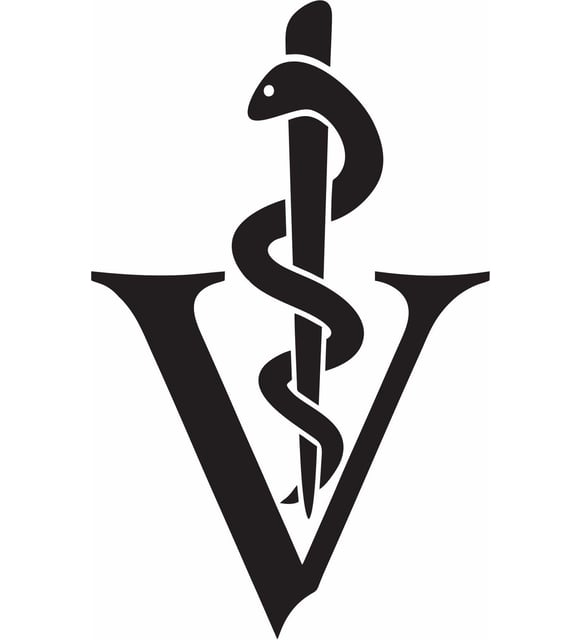

# Veteriner Yönetim Sistemi

- veteriner doktorları kaydedecek,
- doktorların çalışma günlerini (müsait günlerini) kaydedecek, 
- saat olmadan tarih olarak kayıt yapılacak,
- müşterileri kaydedecek,
- müşterilere ait hayvanları kaydedecek,
- hayvanlara uygulanmış aşıları tarihleriyle birlikte kaydedecek,
- hayvanlar için veteriner hekimlere randevu oluşturacaklar,
- randevu oluştururken tarih ve saat girilecek,
- randevu oluştururken hem doktorun müsait günlerinden saat olmadan kontrol yapılmalı hem de randevu kayıtlarından tarih ve saat ile kontrol yapılmalı.
- Kayıtlarda çakışma olmadığı durumda randevu oluşturulmalıdır.

# API Temel Özellikleri
- Hayvanların ve Sahiplerinin (customer) Yönetimi

- Hayvanları kaydetme, bilgilerini güncelleme, görüntüleme ve silme

- Hayvan sahiplerini kaydetme, bilgilerini güncelleme, görüntüleme ve silme

- Hayvan sahipleri isme göre filtrelenecek şekilde end point oluşturmak.

- Hayvanlar isme göre filtrelenecek şekilde end point oluşturmak.

- Hayvan sahibinin sistemde kayıtlı tüm hayvanlarını görüntülemek için API end point'ini oluşturmak. Hayvan sahibine göre hayvanlara filtreleme yapmalısın.

# UML Diagram
- [Akış Diagramı](https://lucid.app/lucidchart/5bdfb429-b333-491d-b54b-609e50a2b6ac/edit?beaconFlowId=7C77878F4C0F1A5E&invitationId=inv_1cc18cb4-fd2a-4459-9224-413b454a1181&page=0_0#)

# Kullanılan Teknolojiler
- Spring web
- Lombok 
- Spring Data JPA 
- Postgre SQL
- Java 21

